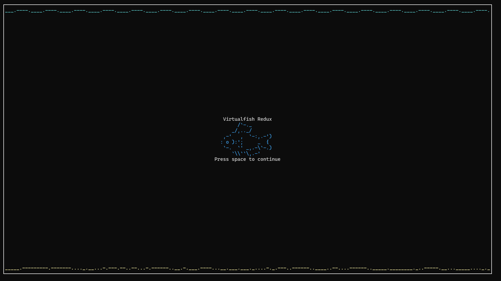

# Virtualfish Redux
This is a "redux" of the [virtualfish project](https://www.github.com/kirkseytc/virtualfish), remaking it from scratch and impementing new features.

## Install

## Running
To run virtualfish-redux either run `virtualfish` or `vfish`.

After starting execution you will be greeted with this title screen.  
Simply press space to continue.  

### Commands
To run a command type a `:`.  
This will pause gameplay and bring up a input window.  
In this window you are able to type in commands to interact with the tank.  

|Command|Argument|Description|
|:-|:-|:-|

### Flags
|Flag|Argument|Description|
|:-|:-|:-|
|`-s`|`<seed>`|Seeds the randomizer to the amount passed in `<seed>`|
|`-c`|`<count>`|Sets the starting amount of fish to the amount passed in `<count>`|
|`-m`|`<max>`|Sets the max amount of fish possible to the amount passed in `<max>`|
|`-bw`|N/A|Starts in Black and White mode|
|`-nt`|N/A|Skips the title screen|

Example: 
Start with 5 fish, a max of 20 fish, and skip the title screen

`virtualfish -c 5 -m 20 -nt` 

_Note: The order of the flags does not matter._

## Releases

## Why does redux exist?
Redux exists because I want to have a crack at this idea again with
new understanding of programming with C/C++ and with a vision of 
what the final product will look like from the beginning.

